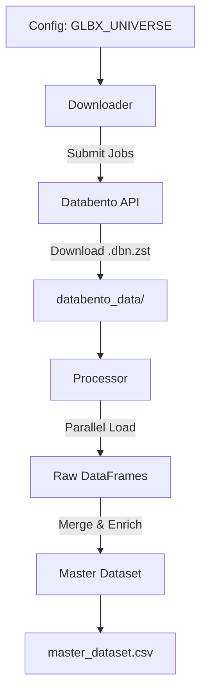

# TSMOM Carry Strategy Data Pipeline


A production-grade data pipeline for Time Series Momentum (TSMOM) and Carry strategies. This repository handles the robust downloading, processing, and normalization of futures data from Databento.

## 🚀 Features

-   **Robust Bulk Downloading**: Handles API rate limits, large file downloads, and job management via `src/download.py`.
-   **Parallel Processing**: High-performance data ingestion using `concurrent.futures` in `src/process_dataset.py`.
-   **Smart Symbology**: Automatically maps raw symbols to asset classes and regions using a centralized configuration.
-   **Production Logging**: Comprehensive logging to both console and `logs/` directory for full observability.
-   **Automation**: Standardized `Makefile` for one-command workflows.

## 📂 Project Structure

```text
tsmom_carry/
├── databento_data/       # Raw data storage (GitIgnored)
├── logs/                 # Runtime logs
├── src/                  # Source Code
│   ├── __init__.py
│   ├── config.py         # Universe & Contract Definitions
│   ├── download.py       # Databento Download Logic
│   └── process_dataset.py # Data Processing & Merging
├── tests/                # Test Suite
├── _archive/             # Legacy scripts
├── Makefile              # Automation
├── pyproject.toml        # Project Configuration
├── requirements.txt      # Dependencies
└── README.md             # Documentation
```

## 🛠️ Installation

1.  **Clone the repository**:
    ```bash
    git clone https://github.com/your-org/tsmom_carry.git
    cd tsmom_carry
    ```

2.  **Install dependencies**:
    ```bash
    make install
    ```

3.  **Set API Key**:
    ```bash
    export DATABENTO_API_KEY=your_api_key
    ```

## ⚡ Usage

### Download Data
Download the defined universe of futures contracts.
```bash
make download
```

### Process Data
Process raw files into a master dataset (`master_dataset.csv`).
```bash
make process
```

### Run Tests
Execute the test suite to verify integrity.
```bash
make test
```

## 🏗️ Architecture



## 📝 Configuration

The asset universe is defined in `src/config.py`. To add new contracts, simply append a `RootContract` to the `GLBX_UNIVERSE` list:

```python
RootContract("GLBX.MDP3", "ES.FUT", "Equity", "US")
```

## 🛡️ License

Proprietary and Confidential.